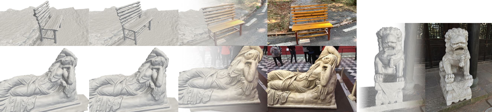

<h1 align="center">Sparfels: Fast Reconstruction from Sparse Unposed Imagery</h1>

<p align="center">
  <a href="https://scholar.google.com/citations?user=COw5y4EAAAAJ&hl=en"><strong>Shubhendu Jena</strong></a><sup>†</sup>
  ·
  <a href="https://ouasfi.github.io/"><strong>Amine Ouasfi</strong></a><sup>†</sup>
  ·
  <a href="https://orcid.org/0000-0002-4831-3343"><strong>Mae Younes</strong></a>
  ·
  <a href="https://boukhayma.github.io/"><strong>Adnane Boukhayma</strong></a>
</p>

<p align="center">
  <a href="https://www.inria.fr/en"> Inria </a>  
  <br>
  <strong>ICCV 2025</strong>
</p>

<div align="center">

[](https://shubhendu-jena.github.io/Sparfels-web/)
&nbsp;
[](https://arxiv.org/abs/2505.02178)
&nbsp;
[](https://openaccess.thecvf.com/content/ICCV2025/papers/Jena_Sparfels_Fast_Reconstruction_from_Sparse_Unposed_Imagery_ICCV_2025_paper.pdf)

</div>

<p align="center">
  <sup>†</sup> Equal contribution
</p>

<p align="center">
  
</p>

---

## Installation

> **Tested:** Ubuntu 22.04+, Conda, Python 3.9, PyTorch 2.5.1 (CUDA 12.1 wheels).

```bash
# Clone repo
git clone --recurse-submodules https://github.com/Shubhendu-Jena/Sparfels.git
cd Sparfels

# Create and activate environment
conda create -n sparfels python=3.9 -y
conda activate sparfels

# PyTorch (CUDA 12.1 wheels)
pip install torch==2.5.1 torchvision==0.20.1 torchaudio==2.5.1 --index-url https://download.pytorch.org/whl/cu121

# Core dependencies
pip install kornia plyfile open3d scikit-image

# Local submodules
pip install -v -e ./submodules/simple-knn --no-build-isolation
pip install -v -e ./submodules/diff-surfel-rasterization --no-build-isolation

# MASt3R requirements
cd submodules/mast3r/dust3r/ && pip install -r requirements.txt && pip install -r requirements_optional.txt || true
cd .. && pip install -r requirements.txt
mkdir -p checkpoints/
wget https://download.europe.naverlabs.com/ComputerVision/MASt3R/MASt3R_ViTLarge_BaseDecoder_512_catmlpdpt_metric.pth -P checkpoints/
cd ../..

# FAISS + Cython
conda install -y -c conda-forge "faiss-cpu=1.8.*"
pip install cython

# ASMK (build from source)
git clone https://github.com/jenicek/asmk
cd asmk/cython/ && cythonize *.pyx
cd ..
pip install -e .   # or: python setup.py build_ext --inplace
cd ..

# Build Dust3R curope extension
cd submodules/mast3r/dust3r/croco/models/curope/
python setup.py build_ext --inplace
cd ../../../../../..

# Extras + scientific stack pins
pip install mediapy embreex evo
pip install --upgrade "numpy>=2.0,<3" "scipy>=1.13,<2" "scikit-learn>=1.4,<2" "open3d>=0.18.0"

# PyTorch3D (for torch 2.5.1 + cu121)
conda install -y -c iopath iopath
conda install -y -c bottler nvidiacub
pip install --extra-index-url https://miropsota.github.io/torch_packages_builder pytorch3d==0.7.8+5043d15pt2.5.1cu121
```

---

## Quickstart

```bash
# Train (DTU split set 0 / set 1)
bash scripts/dtu_train.sh -s 0
bash scripts/dtu_train.sh -s 1

# Evaluate (DTU split set 0 / set 1)
bash scripts/eval_depth.sh -s 0
bash scripts/eval_depth.sh -s 1
```

---

## Data

### DTU
Download the DTU dataset and set the dataset path inside:
- `scripts/dtu_train.sh`
- `scripts/eval_depth.sh`

> Look for variables such as `DTU_ROOT`, `DATA_ROOT`, `DATA_DIR`, etc.

---

## Training (DTU)

We train on DTU using two official splits: **set 0** and **set 1**.

```bash
# Train set 0
bash scripts/dtu_train.sh -s 0

# Train set 1
bash scripts/dtu_train.sh -s 1
```

Training outputs are written to the output folders configured in the scripts (commonly `./output_set_0/` and `./output_set_1/`).

---

## Evaluation (Depth + Camera/Pose)

### Run per-split evaluation
```bash
# Evaluate set 0
bash scripts/eval_depth.sh -s 0

# Evaluate set 1
bash scripts/eval_depth.sh -s 1
```

### Gather depth metrics (median alignment)
```bash
python gather_depth_metrics.py --model_path ./output_set_0 --alignment median
python gather_depth_metrics.py --model_path ./output_set_1 --alignment median
```

### Aggregate depth metrics across splits
```bash
python mean_depth_median.py \
  ./output_set_0/depth_normal_median.txt \
  ./output_set_1/depth_normal_median.txt \
  ./mean_depth_metrics.txt
```

### Pose/camera metrics (per split)
```bash
python mean_calculate_pose.py ./output_set_0
python mean_calculate_pose.py ./output_set_1
```

### Aggregate camera metrics across splits
```bash
python mean_cam_metrics.py \
  --files ./output_set_0/pose_mean_metrics.txt ./output_set_1/pose_mean_metrics.txt \
  --output ./mean_cam_metrics.txt
```

**Final outputs**
- `mean_depth_metrics.txt`
- `mean_cam_metrics.txt`

---

## Troubleshooting

### Submodules missing
```bash
git clone --recurse-submodules https://github.com/Shubhendu-Jena/Sparfels.git
```

### Rebuild Dust3R curope extension
```bash
cd submodules/dust3r/croco/models/curope/
python setup.py build_ext --inplace
```

### PyTorch/CUDA mismatch
This repo was tested with **PyTorch 2.5.1 + CUDA 12.1 wheels**. If you use a different CUDA / PyTorch version, reinstall PyTorch3D accordingly and rebuild extensions.

---

## Citation

If you find this code useful, please cite:

```bibtex
@inproceedings{jena2025sparfels,
  title     = {Sparfels: Fast Reconstruction from Sparse Unposed Imagery},
  author    = {Jena, Shubhendu and Ouasfi, Amine and Younes, Mae and Boukhayma, Adnane},
  booktitle = {Proceedings of the IEEE/CVF International Conference on Computer Vision (ICCV)},
  year      = {2025},
  month     = {October},
  pages     = {27476--27487},
  note      = {arXiv:2505.02178}
}
```

---

## Acknowledgements

This repository builds on several open-source projects (see `submodules/`). Please refer to their respective licenses and citation instructions.

---

## License

See the `LICENSE` file for details. Note that submodules may have their own licenses.
