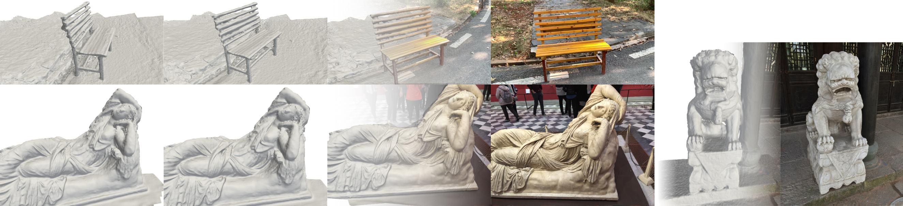

    <h1 align="center">Sparfels: Fast Reconstruction from Sparse Unposed Imagery</h1>
    

        <a href="https://scholar.google.com/citations?user=COw5y4EAAAAJ&hl=en"><strong>Shubhendu Jena†</strong></a>
        .
        <a href="https://ouasfi.github.io/"><strong>Amine Ouasfi†</strong></a>
        ·
        <a href="https://orcid.org/0000-0002-4831-3343"><strong>Mae Younes</strong></a>
        ·
        <a href="https://boukhayma.github.io/"><strong>Adnane Boukhayma</strong></a>
    

    

        <a href="https://www.inria.fr/en/inria-centre-rennes-university">INRIA Rennes</a>
         
        <strong>ICCV 2025</strong>
    

    

        
        
        
    

    
†Equal contribution

    

